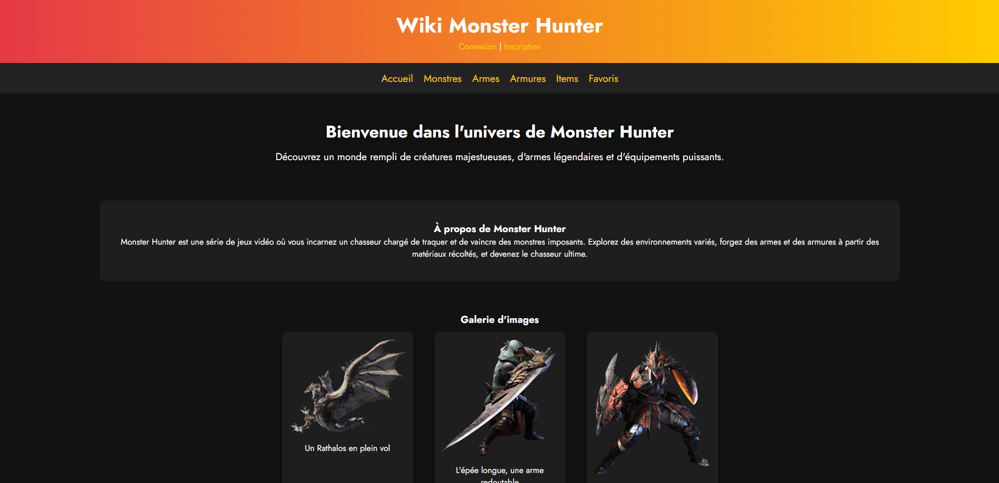
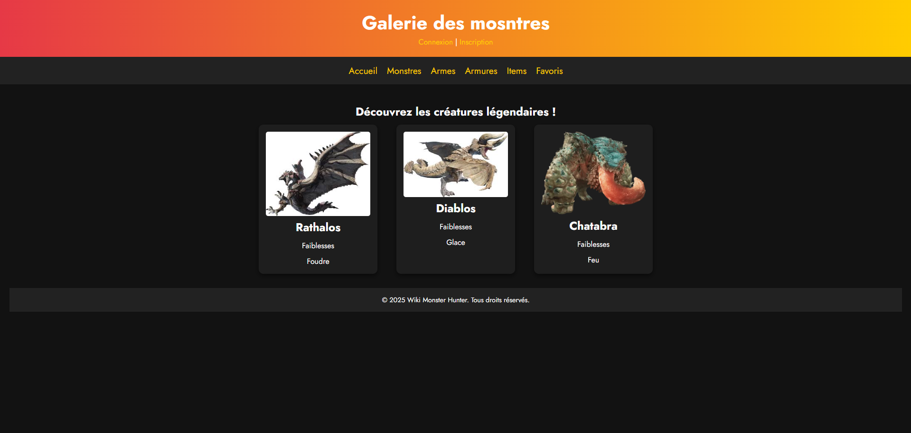
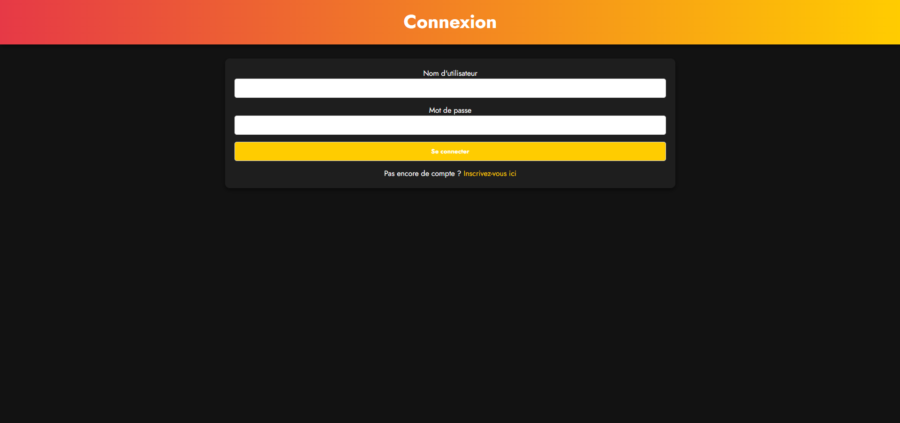
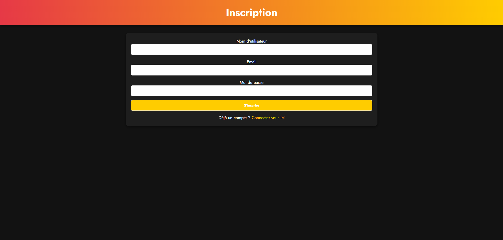

# WikiMH - Monster Hunter Wiki

Bienvenue sur WikiMH, un projet de wiki dédié à l'univers de Monster Hunter ! Ce projet est développé en PHP en utilisant une architecture MVC (Modèle-Vue-Contrôleur) et est automatisé avec GitHub Actions pour les tests et le déploiement.

## Caractéristiques

- **Langage** : PHP
- **Architecture** : MVC
- **Automatisation** : GitHub Actions pour les tests et le déploiement

- **Image de l'application (statique)** :
  
  
  
  

## Prérequis

- PHP 8.0
- Composer
- Docker

## Installation

1. **Cloner le dépôt** :

   ```bash
   git clone https://github.com/votre-utilisateur/WikiMH.git
   cd WikiMH
   ```

2. **Installer les dépendances** :

   ```bash
   composer install
   ```

3. **Construire l'image Docker** :
   ```bash
   docker build . --file Dockerfile --tag my-image-name:$(date +%s)
   ```

## Utilisation

- **Lancer l'application** :

  - Utilisez Docker pour lancer l'application ou configurez un serveur web local pour héberger le projet.

- **Ajouter des images** :

  - Placez vos images dans le répertoire prévu à cet effet. Voici un exemple d'intégration d'images dans l'application :

  [images1]

## GitHub Actions

Le projet utilise GitHub Actions pour automatiser les tests et le déploiement. Voici un aperçu du workflow :

- **Déclencheurs** :

  - `push` et `pull_request` sur la branche `main`.

- **Jobs** :
  - `laravel-tests` : Exécute les tests PHP et construit l'image Docker.

## Contribuer

Les contributions sont les bienvenues ! Pour contribuer :

1. Forkez le projet.
2. Créez une branche pour votre fonctionnalité (`git checkout -b feature/ma-fonctionnalite`).
3. Commitez vos modifications (`git commit -m 'Ajout de ma fonctionnalité'`).
4. Poussez vers la branche (`git push origin feature/ma-fonctionnalite`).
5. Ouvrez une Pull Request.

---

N'hésitez pas à explorer et à contribuer à WikiMH pour enrichir la communauté Monster Hunter !
